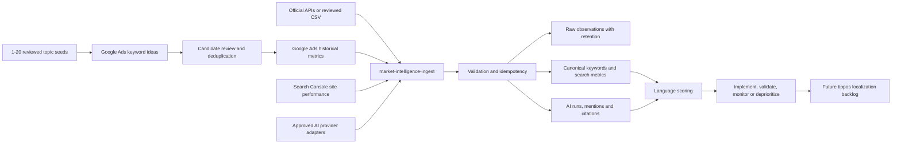

# tippos Market Intelligence

## Outcome

This internal marketing subsystem collects authorized aggregate search observations and repeatable AI-visibility measurements without touching tippos payment or customer data. It ranks candidate product languages only when measured provider observations exist.

## Architecture



The database objects live in the `market_intelligence` schema. Raw tables grant no access to `anon` or ordinary authenticated users. Server ingestion uses two `service_role`-only RPCs. The language dashboard uses a narrow RPC and requires an explicit viewer, analyst or admin assignment.

## Language decision model

Each candidate language receives scores for demand (30%), growth (15%), business relevance (20%), AI visibility gap (10%), competition opportunity (10%), data coverage (10%) and localization effort (5%). The database stores every component, formula version and rationale.

A language cannot receive an implementation recommendation with less than 35% coverage. A score of at least 70 and confidence of at least 0.60 creates an `implement` candidate. Product rollout should still require two consecutive periods. Readiness records are created only through an evidence-backed review; none are pre-populated.

## Data dictionary

| Area | Tables | Purpose |
|---|---|---|
| Access | `access_roles`, `audit_log` | Explicit viewer/analyst/admin assignment and audit trail |
| Sources | `sources`, `connector_accounts`, `connector_configs` | Connector state; only secret references, never secret values |
| Jobs | `collection_jobs`, `collection_job_attempts`, `raw_observations` | Retryable jobs, provenance, raw retention and deduplication |
| Search | `keywords`, `keyword_variants`, `topics`, `keyword_topics`, `search_metrics` | Canonical multilingual demand time series |
| SERP | `search_results_snapshots`, `search_result_items`, `domains` | Authorized ranking snapshots and canonical domains |
| AI | `ai_prompt_sets`, `ai_prompts`, `ai_runs`, `ai_responses`, `ai_mentions`, `ai_citations`, `brands` | Repeatable model visibility, citations and competitors |
| Evidence | `market_evidence` | Cited, structured facts from authoritative public sources; kept separate from search demand |
| Decisions | `language_market_scores`, `language_rollout_readiness`, `content_opportunities`, `score_definitions`, `daily_aggregates` | Explainable market prioritization and gated product rollout |
| Operations | `alerts`, `data_quality_issues`, `strategy_access_attempts` | Freshness, failures, anomalies, private-assistant rate limiting and remediation |

## US plain-English strategy assistant

The `market-intelligence-us-strategy` Edge Function answers a founder's US-market question using only the cited US records in `market_evidence`. It requires the existing backend key or the private browser access code and `OPENAI_API_KEY`; it does not expose the database to browser clients.

For growth questions it may also receive `mi_get_growth_campaign_snapshot` through an optional website-to-MI integration. The standalone MI project does not require the app's analytics or pilot tables: when the integration RPC is unavailable, the assistant continues with market evidence and reports that campaign performance is unavailable. Any future bridge must remain aggregate-only and exclude email, pilot free text, and sandbox rows.

```json
{ "question": "What should tippos do next in the US?" }
```

Its response includes the plain-English answer, the complete source records supplied to the model, and explicit limits for data that has not yet been collected.

The separate private browser page is `tools/tippos-us-strategy-assistant.html`. It is not part of the existing tippos website or Lovable project.

Every measurement has source, observation date, data nature and confidence. `event_at` is distinct from `ingested_at`. Missing values remain null rather than being converted to zero.

Google Ads Keyword Planner and Google Search Console answer different questions:

- `google_ads_keyword_planner` is the primary market-demand source. It stores Google's
  approximate monthly searches for specified US English keywords, including monthly history.
  Google can aggregate close variants, and the counts are searches rather than unique people,
  so this source is explicitly `third_party` with the provider limitations retained in each raw
  observation.
- `google_search_console` is a secondary first-party visibility source. It stores queries for
  which a `tippos.app` page appeared in Google Search, with clicks, impressions, CTR and average
  position. It does not estimate total market demand.

`market_intelligence.v_data_dictionary` exposes the live table/column/type/default catalog to trusted server-side tooling, so the dictionary cannot drift from the applied schema.

## Setup

1. The `project_id` in `supabase/config.toml` is the local CLI namespace for this subproject. Link it only to the standalone MI project with `supabase link --project-ref irprsggvvfxakctlotga`; do not reuse the app project's remote reference. Treat this directory as the dedicated MI migration stream, not as the app's migration history. The first 22 checked-in migration versions match the hosted internal project as of 2026-07-24; the later local guard migration awaits explicit deployment. Follow [Migration reconciliation](./migration-reconciliation.md) for the verified state and future workflow.
2. Call ingestion functions with a Supabase secret key in the `apikey` header. Hosted Edge Functions receive the project's named secret keys automatically. The gateway JWT check is intentionally disabled for `market-intelligence-ingest` and `market-intelligence-openai` so current named secret keys can reach the handler; both functions reject requests unless their internal constant-time backend-key check succeeds. A separate `MARKET_INTELLIGENCE_INGEST_KEY` of at least 32 bytes is accepted only by `market-intelligence-ingest`; it cannot access the strategy assistant, provider syncs, history, or OpenAI adapter.
3. Deploy `market-intelligence-ingest` after the migrations. `market-intelligence-gsc-sync` is also ready and starts loading after valid service-account credentials with read access to the configured Search Console property are present.
   For automatic daily collection, create Vault secrets named `mi_project_url` (the project URL) and `mi_service_role_jwt` (the legacy service-role JWT used only by the database scheduler). The Edge Function keeps Supabase JWT verification enabled and also verifies backend access itself. The scheduled job safely does nothing until both secrets exist.
4. `market-intelligence-google-ads-sync` is deployed with JWT verification enabled, but its
   source remains `disabled_pending_credentials`. To activate market-wide keyword demand,
   first store these Supabase Edge Function secrets:
   - `GOOGLE_ADS_CLIENT_EMAIL`
   - `GOOGLE_ADS_PRIVATE_KEY`
   - `GOOGLE_ADS_DEVELOPER_TOKEN`
   - `GOOGLE_ADS_CUSTOMER_ID`
   - `GOOGLE_ADS_LOGIN_CUSTOMER_ID` only when requests must be made through a manager account

   Enable the Google Ads API in the service account's Cloud project and add the service-account
   email as a user of the intended Google Ads account. The developer token must have Basic or
   Standard access with the permissible use `Researching keywords and recommendations`; Explorer
   access cannot use `KeywordPlanIdeaService` for this production workflow.

   The checked-in workflow is fixed to United States, English and Google Search and has two
   deliberately separate stages:

   - `market-intelligence-google-ads-discover` accepts 1-20 reviewed topic seeds and returns up to
     1,000 deduplicated candidate strings from `GenerateKeywordIdeas`. It does not have a database
     client, does not call the ingestion RPC, and labels its response
     `candidate_only_not_measured`.
   - After relevance review, pass the candidate array as `keywords` to
     `market-intelligence-google-ads-sync`. That function accepts up to 1,000 reviewed terms,
     calls `GenerateKeywordHistoricalMetrics`, and imports only the returned monthly historical
     metrics. Provider results are deterministically sorted and split into batches of at most
     1,000 observations for idempotent ingestion.

   Google permits up to 10,000 keywords in one historical-metrics request, but this connector's
   reviewed-set ceiling is intentionally 1,000. The scheduled request continues to use the 15
   built-in reviewed terms until a larger candidate set has been generated and reviewed; no
   synthetic filler terms are created merely to reach the ceiling.
5. Optionally deploy `market-intelligence-openai`. It uses the official Responses API, stays unavailable without `OPENAI_API_KEY`, processes at most 20 prompts per request and defaults web search to off for cost control. Enable `openai_visibility` only after a credential and budget check.
6. Deploy `market-intelligence-us-strategy` only after storing `OPENAI_API_KEY`, `STRATEGY_ACCESS_CODE_SHA256`, and an independent `STRATEGY_RATE_LIMIT_SALT` of at least 32 bytes as Edge Function secrets. The access-code value must be the lowercase SHA-256 hex digest of a high-entropy code; neither the code, its digest, nor the rate-limit salt belongs in Git. Browser access defaults to `https://tippos.github.io`; set `STRATEGY_ALLOWED_ORIGIN` to a different HTTPS origin before moving the private page. The hosted internal deployment currently allows only its Supabase project origin, and its plaintext access code is retained outside Git. The function stores only a salted client hash, limits repeated failures and hourly use, and fails closed when its database audit guard is unavailable.
7. Keep external sources `disabled_pending_credentials` until their official API credentials are stored in the provider/Supabase secret store. A successful authenticated import moves the source to enabled.
8. Assign dashboard access deliberately by inserting a user into `market_intelligence.access_roles` with `viewer`, `analyst` or `admin` through a trusted administrative process.

Only import observations received from an approved production provider or a reviewed source file. Each batch requires a unique idempotency key and a configured production source. The database rejects synthetic source types and unobserved language scores.

After search ingestion, refresh a period with the service-role-only RPC:

```sql
select public.mi_refresh_language_scores(date '2026-07-01', date '2026-07-31');
select * from market_intelligence.v_language_recommendations
order by total_opportunity_score desc nulls last;
```

The dashboard may list candidate languages with null score fields. It returns a numeric score or recommendation only when backed by at least one non-synthetic provider search observation or production AI run; null fields mean there is not yet enough observed data to score that language.

## Operations and failure handling

- Import batches are limited to 1 MB and 1,000 observations.
- Invalid batches fail atomically; no partially trusted row is silently accepted.
- A dry run validates every row and writes only the job audit result, not observations or metrics.
- Reuse the same idempotency key for retries of the same logical batch. Dry runs occupy a separate internal idempotency namespace, so the same external key can be reused for the subsequent real import.
- Use a new key when the source data changes.
- Keep providers paused when quotas, billing or terms are uncertain.
- Weekly retention cleanup runs automatically on Sundays at 03:15 UTC.
- Google Search Console keyword metrics run daily at 08:30 UTC. Each run reloads the latest three finalized days (ending two days ago) so late Search Console adjustments update idempotently. These are first-party clicks, impressions, CTR and average-position metrics—not total market search volume.
- Google Ads Keyword Planner historical metrics run monthly on the second day at 09:15 UTC.
  Each run requests the built-in reviewed keyword set and upserts Google's available monthly
  history. A manually supplied reviewed set may contain up to 1,000 terms; because each keyword
  can return multiple months, the connector imports the response in deterministic 1,000-row
  batches with content-bound idempotency keys.
  These are approximate searches, not unique searchers, and may include close variants.
- Private strategy-assistant access is atomically reserved and capped at eight failed attempts per client hash in 15 minutes, 30 browser requests per client hash per hour, and 200 browser requests globally per hour. Audit rows contain no raw address and are deleted after 30 days.
- Previous-month language scoring runs automatically on the first day of each month at 04:00 UTC. Also run scoring after a successful material ingestion when an immediate decision update is needed.
- Investigate open `data_quality_issues` before acting on a language recommendation.

## Verification

Run `npm run check` for structural checks and `npm test` for parser, privacy and validation tests. The hosted internal project has also passed migration alignment, dry-run, database lint, data-fingerprint, function-privilege, cron, and forbidden-viewer checks documented in the [migration reconciliation record](./migration-reconciliation.md). A blank-database replay remains recommended for reproducibility when a Docker-compatible runtime or disposable branch is available; it is not a blocker for internal pre-launch use.

## Connector status

The database and five original Edge Functions are deployed for internal use. The separate Google Ads discovery function is checked in but is not production evidence and still requires deployment alongside the updated sync function. Google Ads remains disabled until its dedicated credentials are supplied; deployed code alone is not evidence of live Google Ads data. Google Ads market demand follows the current [keyword-ideas guide](https://developers.google.com/google-ads/api/docs/keyword-planning/generate-keyword-ideas) and [historical-metrics guide](https://developers.google.com/google-ads/api/docs/keyword-planning/generate-historical-metrics) and retains its approximate/close-variant limitations. The AI adapter follows the official [Responses API text-generation guide](https://developers.openai.com/api/docs/guides/text); its model remains environment-configurable so model changes do not require a migration. Google documents that Search Analytics requires OAuth and appropriate property access, supports query/date/country/device dimensions, and paginates with `startRow`; the GSC connector follows the current [Search Analytics query reference](https://developers.google.com/webmaster-tools/v1/searchanalytics/query), caps each run at 50,000 rows and uses read-only OAuth scope. Latin-script Search Console queries initially use `und` rather than a guessed language; Hebrew, Arabic and Japanese scripts are classified deterministically, and unresolved rows remain outside rollout scoring until enriched. Bing Webmaster Tools remains disabled until official credentials are supplied. Private user search histories are out of scope.
